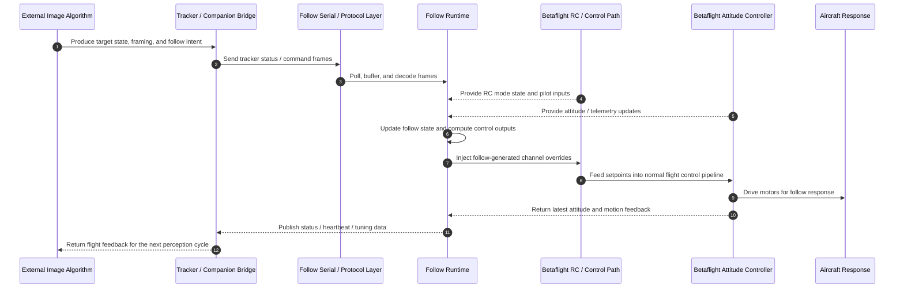

# Betaflight Follow Framework

## Overview

This repository is a framework patch set for adding follow-shot capabilities to Betaflight-based aircraft.

The goal of the project is to give integrators and end users a simple way to build, distribute, and operate assisted follow behaviors on top of a standard Betaflight firmware tree, without turning the flight controller into a one-off fork.

This repository focuses on the follow framework itself:

- runtime integration with Betaflight
- communication with external tracking devices or companion logic
- RC-triggered follow workflow control
- telemetry and attitude data plumbing
- extension hooks for custom follow behaviors
- packaging and delivery tooling for target-specific builds

A simplified end-to-end interaction flow from an external image algorithm to Betaflight response looks like this:



Mode-specific follow behaviors are intended to be added on top of this framework.

## Vision

The long-term vision is to let a pilot enable a follow feature as easily as selecting a flight mode:

- connect a supported tracker or companion system
- flash a firmware build with the follow framework enabled
- use familiar RC actions to arm, confirm, switch, and cancel assisted follow operations
- choose a follow behavior appropriate for the shot

In practice, this means the framework should support both productized consumer workflows and experimental internal development workflows.

## What The Framework Provides

The current framework is designed to provide the following capabilities:

- A dedicated follow runtime inside Betaflight tasks for polling device links, decoding frames, and updating control outputs
- A patch-based integration path that keeps the Betaflight source tree close to upstream
- An internal state container for target tracking, airframe attitude, lens state, RC commands, and control outputs
- A serial transport path for tracker-side status frames, command frames, and tuning/config traffic
- CRSF channel interception so follow-generated control outputs can be injected into the normal receiver pipeline
- A hook system for replacing command dispatch and target-channel computation with project-specific logic
- A packaging model that supports shipping target-specific archives rather than asking end users to rebuild framework internals
- Support for config-based Betaflight targets where `TARGET_NAME` differs from the user-facing build target

## Architecture Summary

At a high level, the framework is split into a few layers:

1. Betaflight integration layer
   Injects tasks, receives flight attitude updates, receives RC frames, and patches the final control path.
2. Follow runtime layer
   Maintains follow state, serial FIFOs, parser state, control state, and lifecycle transitions.
3. Device and protocol layer
   Exchanges commands and status with external tracker hardware or companion-side tooling.
4. Control extension layer
   Allows project-specific code to supply custom channel generation logic and command behavior.
5. Packaging layer
   Builds or distributes target-specific follow artifacts for clean Betaflight trees.

## Recommended Vision Algorithm Platforms

For this framework, the recommended design is to keep image processing outside the flight controller and feed compact target-state results into the follow protocol layer.

Recommended implementation paths include:

- Linux companion computer over UART
  This is the default recommendation for most teams. Run detection, tracking, and optional pose estimation on a companion board, then send normalized target position, confidence, velocity hints, and mode commands to Betaflight. Suitable software stacks include OpenCV plus GStreamer for camera I/O and ONNX Runtime, TensorRT, OpenVINO, RKNN, or NCNN for inference.
- NVIDIA Jetson class platforms
  A strong fit when the project needs higher frame rates, larger models, multi-camera support, or rapid iteration with CUDA-enabled tooling. This is usually the most straightforward path for development teams that want mature GPU acceleration and broad model support.
- Rockchip RK3588 or similar NPU-based SBCs
  A good product-oriented option when cost, power, and deployment volume matter more than maximum model flexibility. These platforms work well for fixed pipelines where the detector and tracker can be converted and validated ahead of release.
- Raspberry Pi class systems with optional accelerator
  A practical choice for early prototyping, lab validation, and simpler follow behaviors. Pairing a Raspberry Pi with a Coral, Hailo, or USB NPU can be enough when the pipeline is lightweight and latency budgets are moderate.
- Smart camera or edge vision module
  A useful approach when the vision stack should be physically isolated from the main companion computer. In this model, the camera module performs detection or tracking internally and exports only subject metadata, bounding boxes, or lock state to the follow framework.
- Split detector plus tracker pipeline
  In many follow-shot products, the most robust architecture is not a single monolithic model but a staged pipeline: detector for reacquire, tracker for high-rate updates, and optional pose or re-identification model for handoff and recovery. This reduces bandwidth and lets the companion send stable, low-rate semantic updates plus high-rate tracking outputs.

In general, the flight controller should not run the image algorithm itself. The FC is best used for deterministic control, mode management, and safe integration with the Betaflight control path, while the external vision side handles camera ingest, inference, target association, and subject-level decision making.

## Repository Layout

- `include/follow/`
  Public framework headers grouped by API area.
- `src/main/follow/`
  Follow runtime sources, framework scaffolding, and extension templates.
- `target/`
  Prebuilt target-specific archives named as `<TARGET_NAME>.a`.
- `scripts/`
  Patch and firmware build helpers.
- `docs/`
  Additional implementation and build notes.

The umbrella header for external inclusion is:

```c
#include "follow/follow.h"
```

## Integration Model

The framework is integrated into a pristine Betaflight tree through a patch script.

The patch performs the following work:

- copies follow headers and sources into the Betaflight source tree
- adds follow tasks to the scheduler
- initializes the follow runtime during FC startup
- feeds Betaflight attitude updates into the follow framework
- captures incoming CRSF channel frames
- allows follow-generated channels to replace selected receiver outputs when follow control is active
- updates follow control mode from the current flight mode string
- adds support for follow-related link inputs during final linking

This approach keeps the integration explicit and reproducible, which is useful both for internal releases and external delivery.

## Quick Start

Use a clean Betaflight source tree as the build root.

Apply the patch:

```bash
cd /path/to/betaflight-4.5.2
bash /path/to/follow-framework/scripts/apply_follow_patch.sh
```

Build firmware with a prebuilt target archive:

```bash
bash /path/to/follow-framework/scripts/build_follow_firmware.sh /path/to/betaflight-4.5.2 STM32H743
```

Pass optional metadata at build time if needed:

```bash
bash /path/to/follow-framework/scripts/build_follow_firmware.sh \
  /path/to/betaflight-4.5.2 \
  MICOAIR743V2 \
  FOLLOW_VERSION=1.0.3 \
  FOLLOW_DESCRIPTION='internal test build' \
  -j$(nproc)
```

The same `FOLLOW_VERSION` and `FOLLOW_DESCRIPTION` variables can also be used when preparing release archives.

## Release Workflow

For maintainers who need to ship framework-enabled builds to users, the intended workflow is:

1. Prepare a clean Betaflight tree with any required config targets.
2. Build target-specific follow archives.
3. Ship this framework directory together with the generated archives.
4. Ask end users to build firmware through the wrapper script.

Prepare the matching release archives for the required targets before shipping the package.

Generated outputs are stored under:

```bash
target/<TARGET_NAME>.a
```

This allows end users to build firmware from a clean tree using only the release package.

## Extension Points

The framework is designed to be extended rather than rewritten.

Key extension surfaces include:

- Command hooks
  Replace tracker-device command dispatch such as heartbeat, start, stop, transfer, move-box, confirm, and lens switch actions.
- Target-channel compute hook
  Supply project-specific logic that converts tracking state into RC channel outputs.
- Mode handler scaffolding
  Use the mode registry and runtime abstractions as the basis for future follow-mode implementations.
- External protocol integration
  Attach alternative trackers, companion computers, or tuning tools to the serial protocol layer.
- PID and profile transport
  Reuse the existing profile transport path for tuning, field calibration, or product-specific parameter management.

The framework is intentionally compatible with protected or project-specific logic that is compiled separately and registered through hooks.

## Candidate Follow Features

The framework is intended to support a broader family of follow-shot behaviors. Likely features include:

- Follow Behind
  Maintain trailing position and heading relative to a moving subject.
- Side Follow
  Hold lateral offset for vehicle, rider, or runner shots.
- Orbit
  Maintain radius around a subject with configurable direction and speed.
- Lead Follow
  Fly ahead of the subject while keeping the camera pointed backward.
- Fixed-Altitude Follow
  Preserve altitude while only adjusting horizontal framing.
- Terrain-Aware Follow
  Adapt height commands using barometer, rangefinder, or terrain estimates.
- Smart Reacquire
  Attempt to re-center and resume after temporary target loss.
- Transfer Follow
  Hand off tracking between sensors, lenses, or companion-side detectors.
- Framing Bias
  Keep the subject intentionally off-center for cinematic composition.
- Safety Corridor
  Enforce horizontal, vertical, speed, and yaw-rate bounds for each follow mode.
- Manual Blend
  Mix pilot stick authority with framework-assisted control.
- Return-To-Pilot Cancel
  Exit follow immediately on a defined RC gesture or failsafe state.
- Shot Presets
  Store reusable behavior presets such as biking, car chase, running, or boat tracking.
- Mission-Assisted Follow
  Blend waypoint logic with follow logic for hybrid shots.
- Companion AI Bridge
  Accept richer target state from external vision or sensor fusion systems.
- Blackbox Markers
  Emit follow-state markers for tuning and post-flight analysis.

## Suggested Product Features

For a polished end-user product, the framework will likely need support around the core runtime:

- CLI or MSP-facing configuration for follow parameters
- OSD status for target lock, mode, source, and fault state
- Failsafe-aware follow abort behavior
- Sensor health reporting for tracker link quality and stale data
- Configurable RC mapping for follow actions
- Build-time feature flags for board families and payload variants
- Logging hooks for state transitions and control output inspection
- Factory calibration support for camera geometry and lens metadata
- Per-airframe parameter packs
- Optional companion-side desktop tuning utility

## Current Project Scope

The scope of this project is to deliver the follow infrastructure needed for a real project:

- reproducible source-tree patching
- scheduler integration
- runtime state and serial plumbing
- control injection path
- extension hooks
- target-archive distribution model

This repository should be read as a framework foundation for follow-shot development, not as a finished library of all follow behaviors.

## Milestones

### M0 - Framework Bootstrap

- Define follow state structures and public headers
- Add runtime initialization and scheduler integration
- Add serial transport and parser plumbing
- Add CRSF input and output interception path
- Add patch and packaging scripts

Status: complete for the current framework baseline.

### M1 - Integrator Extension Surface

- Stabilize hook registration flow
- Finalize mode abstraction contracts
- Provide override template and external integration path
- Document clean integration workflow

Status: mostly complete, ready for integration work.

### M2 - Operational Follow Mode APIs

- Finalize mode lifecycle semantics
- Add parameter schema for per-mode limits and gains
- Add mode selection and runtime switching policy
- Expose status needed by OSD or companion UI

Status: framework-ready, implementation pending.

### M3 - Safety And Recovery Layer

- Add stale-target detection and graceful degradation
- Add explicit follow abort states
- Add failsafe-aware exit behavior
- Add target reacquire policy
- Add watchdogs for invalid tracker state

Status: planned.

### M4 - User-Facing Productization

- Add configuration UX
- Add on-screen status and diagnostics
- Add blackbox observability
- Add preset management
- Add release packaging for supported target families

Status: planned.

### M5 - Advanced Follow Ecosystem

- Add companion-computer bridge
- Add multi-sensor target handoff
- Add mission/follow hybrid workflows
- Add richer cinematic shot orchestration

Status: exploratory.

## TODO

- Define a stable follow mode selection API
- Add an explicit framework state machine document
- Add tracker-link timeout handling
- Add target-loss handling and reacquire policy
- Add RC override priority rules
- Add configuration transport for non-PID runtime parameters
- Add board-level serial port configuration instead of fixed ports
- Add OSD or telemetry-facing status export
- Add event logging for mode transitions and cancel reasons
- Add build matrix documentation for supported targets
- Add automated validation scripts for archive packaging
- Add example companion protocol documentation
- Add integration tests for parser and channel injection paths
- Add unit tests for math helpers and state transitions
- Add safety envelopes for throttle, roll, pitch, and yaw outputs
- Add documentation for per-airframe tuning workflow
- Add documentation for extension packaging
- Add release checklist and versioning policy

## Design Principles

- Keep Betaflight integration explicit and minimal
- Let project-specific follow logic live outside the upstream patch where possible
- Make target delivery simple for end users
- Preserve a clean path for proprietary control modules
- Prefer clear interfaces over large monolithic follow logic
- Build toward safety and recoverability from the start

## Non-Goals

The framework does not aim to:

- replace Betaflight flight control itself
- hide all target-specific integration details from maintainers
- force a single tracker hardware vendor or protocol
- assume a single follow behavior is correct for all products

## Related Files

- `docs/README.md`
  Internal layout and build notes.
- `scripts/apply_follow_patch.sh`
  Applies the framework patch to a Betaflight tree.
- `scripts/build_follow_firmware.sh`
  User-facing build wrapper for patched firmware builds.
- `target/`
  Stores the release archives used by the firmware build workflow.

## License And Project Status

License: this project is open source and is available free of charge without warranty to all users.

Project maturity: active framework development.

Recommended use: internal integration, controlled testing, and staged productization.

## Reference

- [Betaflight integration and build references](https://betaflight.com/docs/development)
